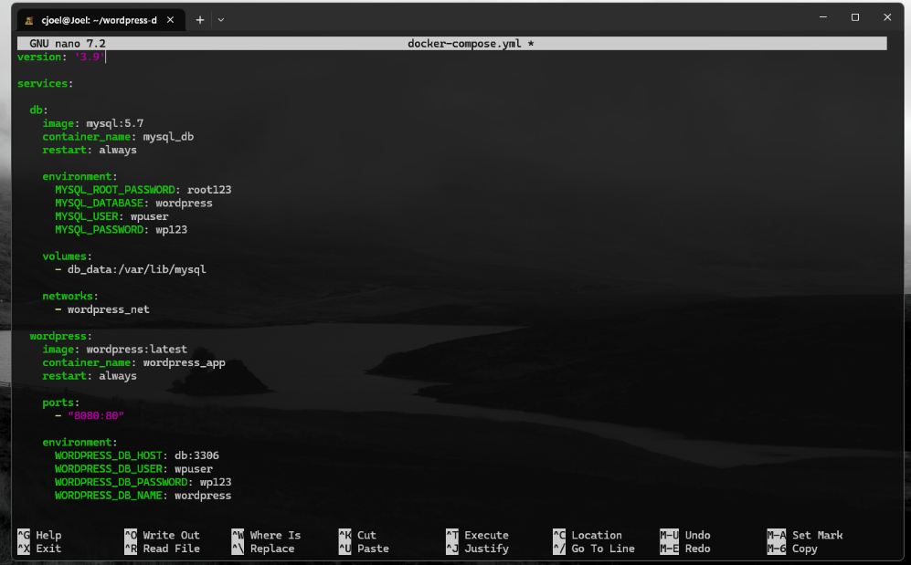
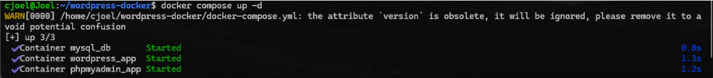
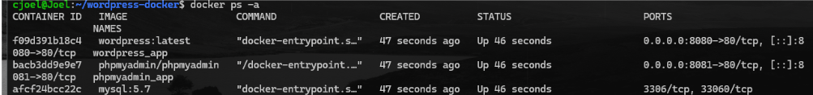
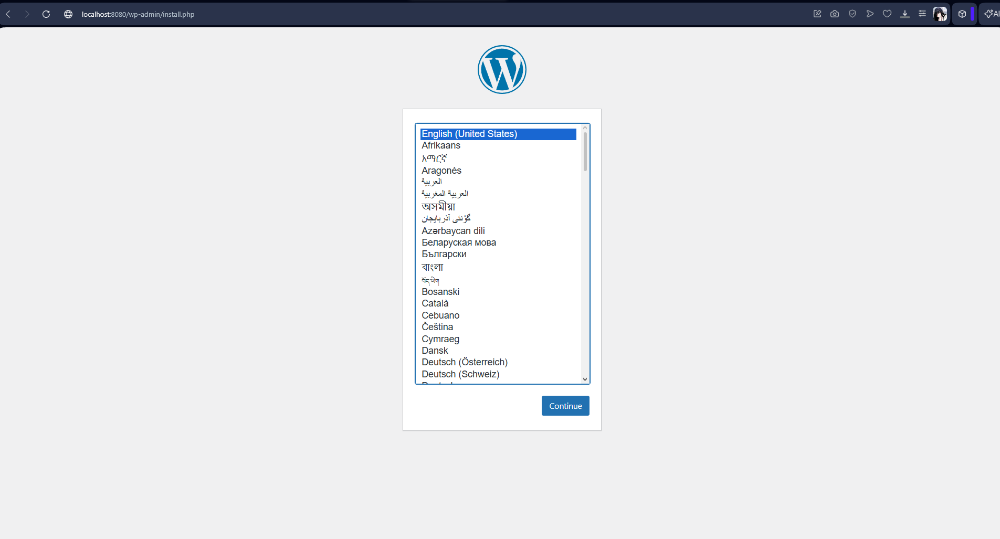
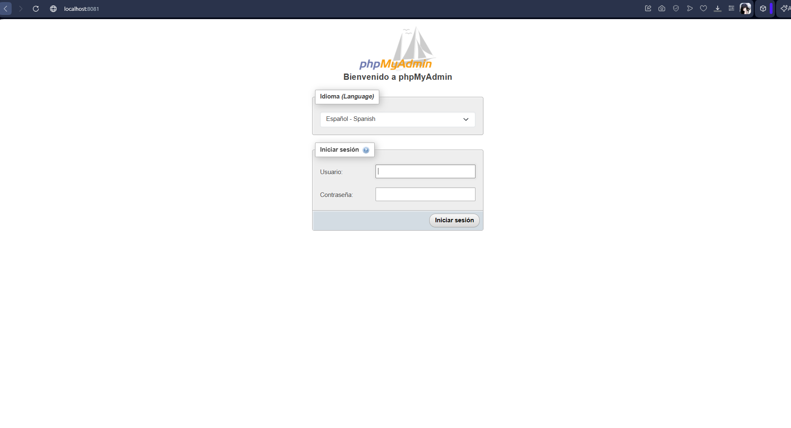
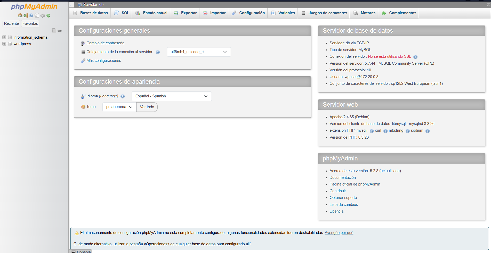

# **Título**

## Implementación de WordPress con Docker Compose utilizando YAML

# **Introducción**

Docker Compose es una herramienta que permite administrar múltiples contenedores mediante un archivo de configuración en formato YAML. En esta práctica se realizó la implementación de un entorno web utilizando WordPress, MySQL y phpMyAdmin, permitiendo automatizar la creación y ejecución de los servicios necesarios para el funcionamiento de un sitio web dinámico. Además, se configuraron redes y volúmenes para garantizar la comunicación entre contenedores y la persistencia de los datos.

# **Objetivos**

## **Objetivo General**

Implementar un entorno de WordPress utilizando Docker Compose mediante un archivo YAML.

## **Objetivos Específicos**

* Configurar los servicios de WordPress, MySQL y phpMyAdmin.  
* Crear y administrar contenedores utilizando Docker Compose.  
* Definir una red para la comunicación entre servicios.  
* Implementar un volumen para la persistencia de datos.  
* Verificar el correcto funcionamiento de los servicios desde el navegador.

## **1\. Crear la carpeta del proyecto**

mkdir wordpress-docker  
cd wordpress-docker

# **Crear el archivo YAML usando nano**

nano docker-compose.yml

# **4\. Ejecutar Docker Compose**

docker compose up \-d

**ver los contenedores**   
docker ps \-a

# **6\. Abrir los hosts en el navegador**

## **WordPress**

 

phpMyAdmin   

# **Resultados**

Durante la práctica se logró crear correctamente el archivo `docker-compose.yml` utilizando el formato YAML. Se configuraron los servicios de WordPress, MySQL y phpMyAdmin, además de establecer una red y un volumen para la comunicación y almacenamiento de datos. Posteriormente, los contenedores fueron ejecutados exitosamente mediante Docker Compose, verificando su funcionamiento desde el navegador a través de los puertos configurados.

**Conclusión**

La práctica permitió comprender el funcionamiento de Docker Compose y la utilidad de los archivos YAML para la administración de múltiples contenedores. Se aprendió a desplegar un entorno completo de WordPress de manera rápida y organizada, facilitando la configuración de servicios, redes y volúmenes. Además, se comprobó la importancia de Docker para simplificar procesos de virtualización y desarrollo de aplicaciones web.

